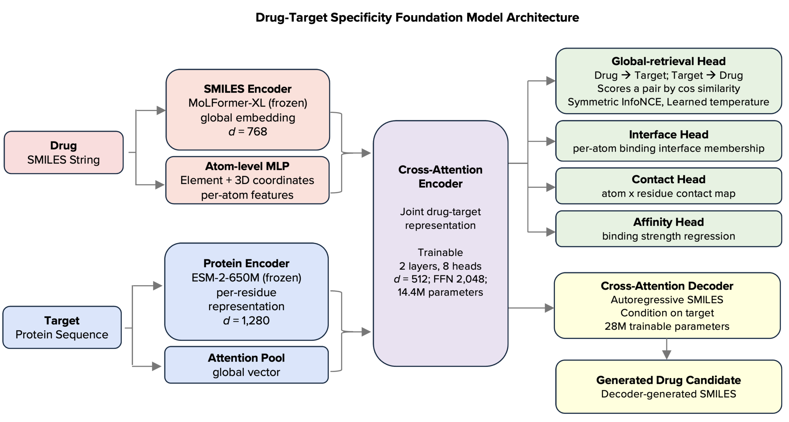

# dtSFM — A Drug–Target Specificity Foundation Model

**Sai T. Reddy** · Department of Biosystems Science and Engineering, ETH Zurich · Botnar Institute of Immune Engineering (BIIE), Basel

[](https://doi.org/10.5281/zenodo.20581780)
[](https://doi.org/10.64898/2026.06.08.730844)
[](LICENSE.md)
[](https://huggingface.co/SFM-BIIE-ETHZ/dtSFM-v3)

---



*Figure 1 | Architecture of the drug–target specificity foundation model (dtSFM). Two frozen pretrained sequence encoders (MoLFormer-XL for the drug SMILES, ESM-2-650M for the protein sequence) feed a trainable cross-attention encoder; four task heads plus a cross-attentive autoregressive decoder read the joint representation.*

---

## Overview

Molecular recognition — which small molecule binds which protein, and with what selectivity — governs the efficacy, safety, and discovery of every therapeutic. **dtSFM** is a **Specificity Foundation Model (SFM)** for drug–target binding: a physics-derived, sequence-native model that maps a (drug, protein) pair to a binding-compatibility score, and generates novel target-conditioned molecules — all from sequence, without constructing a structure.

dtSFM is the **first SFM realisation to pair a full-scale encoder with a generative decoder**. From this single model we demonstrate the three sequence-native applications of drug discovery:

| Application | Direction | What dtSFM does | Headline result |
|---|---|---|---|
| **Off-target safety screening** | drug → target | rank the proteome for a drug's off-targets | documented off-targets at a median rank of 30 / 4,910 genes (top 0.6%) vs a chemoproteomic panel |
| **Library repurposing** | target → drug | rank the 522,776-compound library for a target | 46 novel candidates clear the AlphaFold-3 binder gate across NLRP3 / CD73 / STING1 |
| **Generative design** | target → novel drug | generate novel target-conditioned molecules | 850 / 1,200 (71%) match the AlphaFold-3 structural confidence of the approved drug |

All structural predictions are verified by **AlphaFold-3 as an orthogonal referee** that shares no architecture, training data, or representation with dtSFM (cosine ↔ confidence correlation ≈ 0), so structural agreement is genuine corroboration rather than circular confirmation.

This repository contains the model code, trained weights, training and evaluation pipelines, the three application pipelines, figure-build scripts, supplementary data, and the orthogonal AI audit records.

---

## The Convergence Equation

dtSFM's architecture follows from a physical identity: **transformer softmax attention is mathematically isomorphic to the Boltzmann distribution** governing molecular binding at thermal equilibrium:

$$\underbrace{\text{softmax}\left(\frac{QK^\top}{\sqrt{d}}\right)}_{\text{transformer attention}} = \underbrace{\frac{\exp(-E_{ij}/k_BT)}{\sum_j \exp(-E_{ij}/k_BT)}}_{\text{Boltzmann distribution (biophysics)}}$$

This identity, with five conditions of molecular recognition systems, prescribes a single sequence-native architecture — the Specificity Foundation Model — with a learned temperature corresponding to physical *k*<sub>B</sub>*T*, that computes binding compatibility as a thermodynamic quantity directly from sequence. The framework was established theoretically (Reddy 2026a, 2026b) and realised as prototype encoders across six molecular-recognition domains (Reddy 2026c, *Vibe Coding SFMs*). dtSFM is the drug–target instantiation scaled to a production encoder and extended with a generative decoder.

---

## Architecture

```
SMILES (drug)   ─► MoLFormer-XL (frozen) ─► global 768→512 ──┐
                ╰► atom-level MLP (element + 3D coords) ──────┤
                                                              ├─► dtSFM Cross-Attention Encoder ─┬─► Global-retrieval head (cosine, ↔)
Protein seq     ─► ESM-2-650M (frozen) ─► per-residue 1,280→512┤   (2 layers · 8 heads · d=512    ├─► Interface head (per-atom)
                                       ╰► attention pool ──────┘    · FFN 2,048 · 14.4 M params)   ├─► Contact head (atom × residue)
                                                                                                   ├─► Affinity head (preliminary)
                                                                                                   └─► Cross-Attentive Decoder ─► novel SMILES
```

- **Frozen backbones:** MoLFormer-XL (drug SMILES → 768-d) and ESM-2-650M (protein → 1,280-d per-residue). Not updated.
- **Trainable cross-attention encoder:** 2 layers, 8 heads, d_model = 512, FFN 2,048 (**14.4 M** params), with four output heads (global-retrieval, interface, contact, affinity).
- **Cross-attentive autoregressive decoder:** generates SMILES token-by-token conditioned on the per-residue protein features (**~28 M** params).
- **Total trainable:** ~42 M parameters; trains end-to-end in ~15 h on a single A100.

---

## Model Weights

The production checkpoints are on Hugging Face: [**`SFM-BIIE-ETHZ/dtSFM-v3`**](https://huggingface.co/SFM-BIIE-ETHZ/dtSFM-v3)

| Checkpoint | File | Description |
|---|---|---|
| Encoder | `encoder_b3_epoch010.pt` | locked B-3 encoder (4 heads) |
| Decoder | `decoder_v02_step50000.pt` | cross-attentive generative decoder |

*(The 27.7%-R@1 encoder-only prototype from the Vibe Coding SFMs paper lives separately at [`SFM-BIIE-ETHZ/dtSFM_VC-SFM`](https://huggingface.co/SFM-BIIE-ETHZ/dtSFM_VC-SFM).)*

---

## Quick Start

```bash
git clone https://github.com/Reddy-BIIE-ETHZ/dtSFM.git
cd dtSFM
conda env create -f environment.yml
conda activate calm
```

```python
from huggingface_hub import hf_hub_download
import torch, torch.nn.functional as F
from calm.encoder.model_v3 import CALMEncoderV3
from calm.decoder.model_dtsfm_v3 import CALMDecoderV3

# --- retrieval (drug ↔ target) ---
enc_ckpt = hf_hub_download("SFM-BIIE-ETHZ/dtSFM-v3", "encoder_b3_epoch010.pt")
encoder = CALMEncoderV3.from_pretrained(enc_ckpt).eval()

drug   = encoder.encode_drug("CC(=O)Oc1ccccc1C(=O)O")          # aspirin SMILES
target = encoder.encode_protein("MTEYKLVVVGAGGVGKSALTIQLIQ...")  # protein sequence
score  = F.cosine_similarity(drug, target, dim=-1)              # binding compatibility

# --- generation (target → novel molecules) ---
dec_ckpt = hf_hub_download("SFM-BIIE-ETHZ/dtSFM-v3", "decoder_v02_step50000.pt")
decoder  = CALMDecoderV3.from_pretrained(dec_ckpt).eval()
smiles   = decoder.generate(target_sequence="MTEYKLVVVGAGG...", n=100, temperature=0.8)
```

A frictionless one-paste prompt for applying dtSFM to your own target or library (no coding required) is in [`docs/vibe_coding_starter.md`](docs/vibe_coding_starter.md).

---

## Repository Structure

```
dtSFM/
├── src/calm/                  # model code (encoder, decoder, heads, utils)
│   ├── encoder/model_v3.py    # CALMEncoderV3 (cross-attention + 4 heads)
│   └── decoder/model_dtsfm_v3.py  # CALMDecoderV3 (generative)
├── applications/
│   ├── safety_screen/         # drug → proteome off-target ranking (Klaeger validation)
│   ├── repurposing/           # target → 522,776-library ranking (NLRP3/CD73/STING1)
│   └── generative_design/     # target → novel SMILES + 5-stage cascade
├── evaluation/                # pool/full retrieval R@K, interface/contact AUROC, leakage
├── figures/                   # Figure 1–7 build scripts + data
├── supplementary/             # Supp Table S1 (design SMILES) + supp figures
├── tokenizer/dtsfm_v3_decoder/ # decoder SMILES tokenizer (MoLFormer BPE + [EOS])
├── audit/                     # CLOSED Codex audit (48 PASS/3 PARTIAL/0 FAIL): closure docs, claim sources, leakage
├── zenodo/                    # large-data deposit: metadata, contents manifest, upload script
├── docs/                      # reproducing-claims map, AF3 cofold protocol, HF model card, Vibe Coding starter
├── CITATION.cff
├── LICENSE.md
├── environment.yml
├── requirements.txt
└── README.md
```

---

## Data

All training data is publicly available.

| Source | Curation | Pairs |
|---|---|---|
| PDBbind v2020 | experimentally measured Kd/Ki/IC50 from PDB co-crystals | 19,037 |
| SAIR | ChEMBL + BindingDB potencies paired with Boltz-1x interfaces (iPTM ≥ 0.70 AND confidence ≥ 0.70) | 695,710 |
| **Combined** | 522,776 unique drugs · 22,964 unique proteins | **714,747** |

Split: whole MMseqs2 protein-sequence clusters held out (80% identity) → 592,888 train / 65,951 validation / 55,908 test, with verified zero pair/protein/cluster leakage.

---

## Reproducibility

| Setting | Encoder | Decoder |
|---|---|---|
| Optimizer | AdamW (lr 1e-4, wd 0.2) | AdamW (lr 2e-4 → 1e-6 cosine) |
| Batch | 128 pairs | 64 pairs |
| Schedule | 15 epochs (~70k steps) | 100k steps (checkpoint @ 50k) |
| Hardware | 1× NVIDIA A100 40 GB | 1× NVIDIA A100 40 GB |
| Loss | InfoNCE + interface/contact BCE + affinity MSE | teacher-forced cross-entropy |

AlphaFold-3 cofolding (>2,000 cofolds) was run on the Alps supercomputer (CSCS, GH200). See [`docs/alphafold3_cofold_protocol.md`](docs/alphafold3_cofold_protocol.md).

---

## Vibe Coding and Orthogonal Verification

**Vibe coding — [Claude Code](https://claude.ai/code) (Anthropic):** dtSFM was built by a domain expert (S.T.R.) with biological and ML conceptual knowledge but no Python programming experience; Claude Code directed all data preprocessing, training, SLURM job management, and evaluation through natural-language prompts.

**Orthogonal verification — two independent referees.**

- **Structural — AlphaFold-3.** Every binding prediction is checked by AlphaFold-3, which shares no architecture, training data, or learned representation with dtSFM; on the candidate sets the dtSFM cosine is essentially uncorrelated with AlphaFold-3 confidence (Pearson *r* ≈ 0), so structural agreement is independent corroboration, not circular confirmation.
- **Numerical — Codex (OpenAI).** Every quantitative claim in the paper was independently re-derived by a second large language model, in a clean session with access only to the artifacts committed here and no access to the development sessions. The audit closed at **48 PASS / 3 PARTIAL / 0 FAIL**, with no numerical claim found in error, and the four direct leakage measurements reproduced the reported values. Full records: [`audit/`](audit/); claim-to-file map: [`docs/reproducing_paper_claims.md`](docs/reproducing_paper_claims.md); archived data: [DOI 10.5281/zenodo.20581780](https://doi.org/10.5281/zenodo.20581780).

This mirrors the *Orthogonal AI verification* subsection of the paper's Methods.

---

## Citation

```bibtex
@article{reddy2026dtsfm,
  title   = {A drug–target specificity foundation model for off-target prediction, repurposing, and generative design},
  author  = {Reddy, Sai T.},
  journal = {bioRxiv},
  year    = {2026},
  doi     = {10.64898/2026.06.08.730844}
}
```

---

## License

Released under the **SFM Research Preview License v1.0-preview** (see [LICENSE.md](LICENSE.md)).
Free for research use (academic, non-profit, government, and industry research). The specific
molecules disclosed in the accompanying preprints are dedicated to the public (§3). Commercial-use
and patent-licensing terms are deferred and being arranged with ETH Zürich / BIIE; the SFM
architectures and training methods are the subject of pending patent applications.
For commercial enquiries: sai.reddy@ethz.ch
